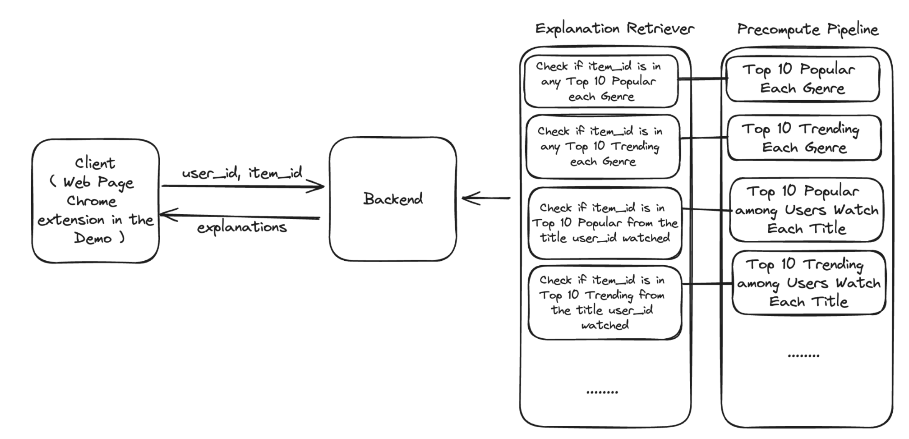
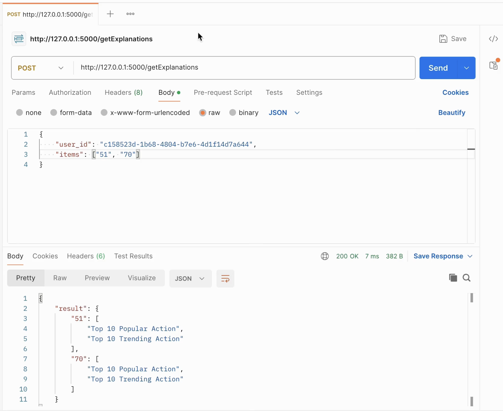

# Explainable Recommendations

## 🏆 Winner of the Best Open-Source Project Award at the Tubi 2024 Hackathon ##

The aim of this project is to generate explanations for recommendations provided to users. By offering clear and understandable explanations, we aim to build users' trust and increase the likelihood of converting recommendations into actual viewership.

This project develops a service that delivers explanations for any given item IDs and device ID. It is designed to be model-agnostic, meaning it can work seamlessly with any recommendation models used to generate the initial recommendations.

The concept of this project can be easily adapted to various business use cases, including short videos, movies, products, news, and music recommendations in the e-commerce, entertainment, and streaming industries.

## Architecture design



Each explanation type has a dedicated component in both the precompute pipeline and the explanation retriever.

The precompute pipeline saves intermediate data, ensuring that the explanation retriever can generate explanations in real-time.

The system is designed to be scalable, allowing for the addition of more types of explanations as needed.


## How to run

### Setup
```commandline
conda create --name er python=3.10
conda activate er
pip3 install -r requirements.txt
```

### Start the service

```commandline
python3 ./make_data.py
python3 ./pre_compute.py
python3 ./main.py 
```
### Demo how to run

Download and watch Demo.mp4

API Result Demo

